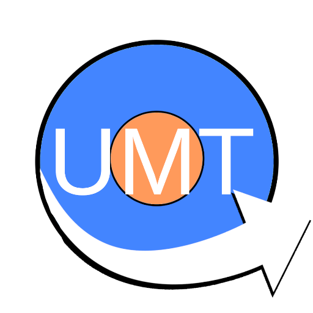

# UMT (Universal Modeling Tool)

An intuitive stylus-oriented modeling tool, mainly focused as a teaching aid.



# How to run locally

 - Make sure you have typescript (`tsc`) installed.
 - Make sure you have node installed (`npm`) 

```
npm install --save-dev lite-server
npm init
tsc
npm start
```

This should open up your default browser, showing the application.
