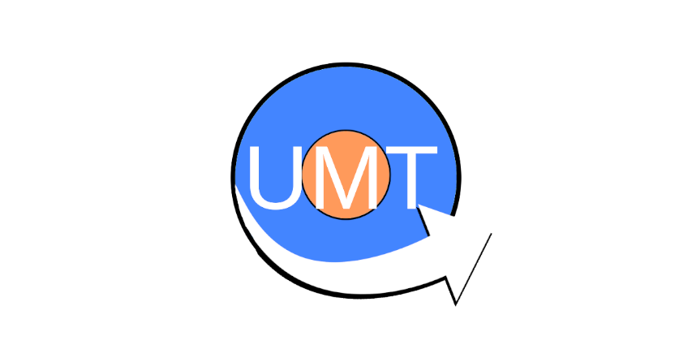

# UMT (Universal Modeling Tool)

An intuitive stylus-oriented modeling tool, mainly focused as a teaching aid.
[Latest DEMO](https://deis-tools.github.io/umt/)



# How to run locally

 - Make sure you have node installed (`npm`) 

```
npm install --save-dev lite-server leader-line jquery
npm init
npm start
```

This should open up your default browser, showing the application.
